# CS324 Assignment 3 Report

## Part I: PyTorch LSTM

> Implement LSTM by PyTorch

### Task 1

I implement the LSTM exactly as described in the document. **Talk is cheap, just check my code.**


### Task 2

Similar to my last assignment, I tried length **5, 10, 15 and 20** on my LSTM model. I also tried **length 50** to show the strength of LSTM. The result is shown below, the accuracy curve and the loss curve.

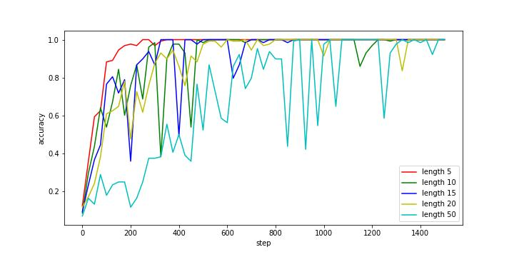

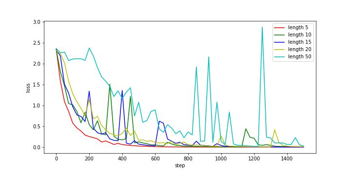

It shows that it really easy for LSTM to find the best solutions for length 5, 10, 15 and 20 inputs. For length 50 inputs, the network became harder to converge, but it still find a good solution before 1500 steps. This is impossible for the RNN we implement in the last assignment to achieve.


## Part II - Generative Adversarial Networks

### Task 1

The dataset and the dataloader is provided by the original code. So the main part is the network architecture of the generator G and the discriminator D.

The Generator is defined as:

```python
class Generator(nn.Module):
    def __init__(self, input_dim):
        super(Generator, self).__init__()
        self.fc = nn.Sequential(
            nn.Linear(input_dim, 1024),
            nn.BatchNorm1d(1024),
            nn.ReLU(),
            nn.Linear(1024, 128*7*7),
            nn.BatchNorm1d(128*7*7),
            nn.ReLU(),
        )
        self.upconv = nn.Sequential(
            nn.ConvTranspose2d(128, 64, 4, stride=2, padding=1),
            nn.BatchNorm2d(64),
            nn.ReLU(),
            nn.ConvTranspose2d(64, 1, 4, stride=2, padding=1),
            nn.Tanh()
        )


    def forward(self, z):
        x = self.fc(z)
        x = x.reshape(-1, 128, 7, 7)
        return self.upconv(x)
```

where we send the noise vector into linear layers and then reshape it to a small image, and do up convolutions.

For discriminator D, it is defined similar to the reverse of G:

```python
class Discriminator(nn.Module):
    def __init__(self):
        super(Discriminator, self).__init__()
        self.net = nn.Sequential(
            nn.Conv2d(1, 32, 5, stride=1),
            nn.LeakyReLU(0.2),
            nn.MaxPool2d(2, stride=2),
            nn.Conv2d(32, 64, 5, stride=1),
            nn.LeakyReLU(0.2),
            nn.MaxPool2d(2, stride=2),
            nn.Flatten(),
            nn.Linear(64 * 4 * 4, 1024),
            nn.LeakyReLU(0.2),
            nn.Linear(1024, 1),
            nn.Sigmoid(),
        )

    def forward(self, img):
        return self.net(img)
```

where we first do convolutions and then go into fully connected layers, just like classic classification networks.

For the training procedure, I first train G and then train D. However, this is not so effective for G.  In order to balance G and D, I **reduce the frequency to train D -- every two epochs**, the frequency to train G stays the same.


### Task 2

See `task2.ipynb` for this part:

Beginning result: 0, 1000, 2000, 3000

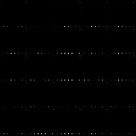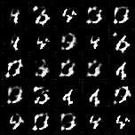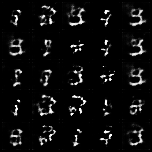

Middle result: 93000, 94000, 95000

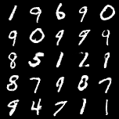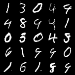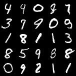

End result: 185000, 186000, 187000

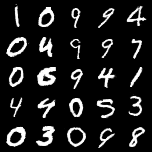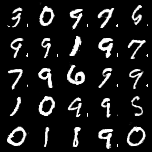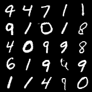


### Task 3

See `task3.ipynb` for this part.

We random sample the begin and the end point, here particularly we got 4 and 1. The following is the result:

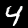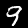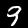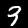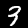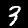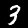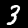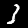

