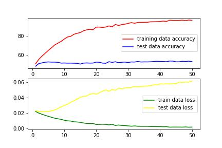
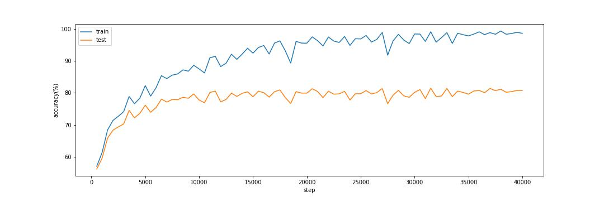
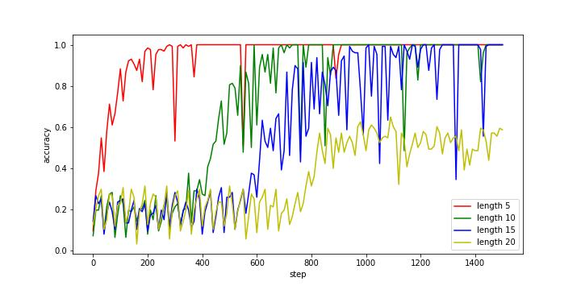
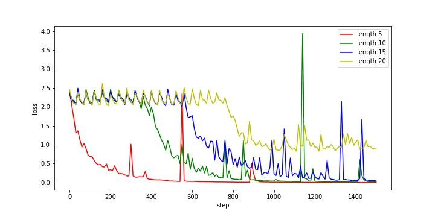

# Assignment 2 Report

## Part I: PyTorch MLP

### Task 1

I add a file `pytorch_dataset.py` to generate points as inputs. To implement the `pytorch` version, I simply modify the code of last assignment with `pytorch` APIs.

### Task 2

In this part, we need to compare the accuracy curve of the two MLPs. The training data are generated by `make_moons`. I use **SGD** in both experiments. The accuracy is recorded during training, and is shown by `visualize.ipynb`. 

Only the first 50 epochs (after 50 epochs are all 100%) are shown to show clearer curve. See follow:

#### pytorch

#### numpy

As we can see, they have similar curves of accuracy. 

### Task 3

The code of this part are in directory `Part 1/cifar10/`. The steps are shown clearly in `train_cifar.ipynb` from dataset processing to training procedure, even with visualization. 

My MLP is a simple network with only linear layers together with `ReLU` as activation function in each layer. The network is designed with:

- **input**: images of height 32, width 32, channel 3 (flattened before going into the hidden layers)
- **hidden layers**: 1024, 256, 64
- **output**: 10 (classes)

- **loss function**: cross entropy
- **learning rate**: 1e-3
- **optimizer**: Adam (betas=(0.9, 0.999), eps=1e-08, weight_decay=0)

However, the result is not so good:

The test accuracy stays at about 50% and loss of test data keeps growing. The train accuracy goes higher and higher. This shows that my MLP has overfitted.

This is a **disappointing** result comparing to the new technology (CNN) nowadays.

## Part 2

### Task 1

My network is implemented exactly as the lecture slide described. 

### Task 2

You can run `visualize.ipynb` to see to result curve.

For training accruracy, it reaches about 97%. However, for test, it only achieves approxiamately 80%. But it is still a better result comparing to the MLP in the previous part.

## Part 3

### Task 1

My network is implemented just as the document described.

### Task 2

The following is the accuracy curve and the loss curve.

It shows that it becomes harder and harder to get obtain satisfying result when length becomes greater and greater. Also, for length 10 inputs, the curve starts to converge since about 400 steps, for length 15, it starts at about 600 steps, and for length 20, it starts even later. The network fails to achieve a good accuracy for length 20 palindromes. 